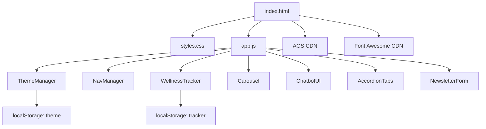

# Design Document

## Overview

The Women's Health & Wellness website is a single-page application (SPA) built with vanilla HTML, CSS, and JavaScript. It delivers informational content, interactive wellness tools, and an engaging UI across 10+ distinct sections. The site prioritizes accessibility, responsiveness, and a calming aesthetic using soft pinks, purples, and gradients.

The architecture is intentionally simple: one HTML file, one CSS file, and one JS file (with optional modular JS files per feature). External dependencies are limited to AOS (scroll animations) and Font Awesome (icons), both loaded via CDN. No build tools or frameworks are required.

---

## Architecture



All JavaScript is organized into self-contained module objects initialized on `DOMContentLoaded`. State that needs persistence is stored in `localStorage`. No server-side code is required.

---

## Components and Interfaces

### 1. Navigation Bar (`NavManager`)
- Fixed/sticky header with links to all 8 major sections
- Hamburger menu toggle on viewports < 768px
- Active link highlighting via `IntersectionObserver`
- Theme toggle button embedded in nav

### 2. Hero Section
- Full-viewport-height with CSS gradient background
- Headline + subtext with CSS `@keyframes` fade-in/slide-up on load
- CTA button scrolls to `#physical-health` on click

### 3. Physical Health Section
- Grid of 3+ cards (exercise, diet, sleep)
- Each card: icon (Font Awesome), title, summary, hidden detail text
- Hover reveals detail via CSS overlay transition (300ms)
- AOS `fade-up` on scroll entry

### 4. Mental Wellness Section
- Accordion-style expandable tips (stress, mindfulness, emotional health)
- Click toggles open/close with CSS `max-height` transition (300ms)
- Configurable: accordion (one open) or multi-expand behavior

### 5. Hormonal Health Section (`AccordionTabs`)
- Tab or accordion UI for menstrual health, pregnancy, PCOS
- Only one panel visible at a time
- AOS entrance animation on scroll

### 6. Daily Wellness Tracker (`WellnessTracker`)
- Water intake: increment/decrement counter (0–8 glasses), progress bar
- Mood: 5 selectable emoji/button options
- Exercise: checkbox toggle
- Reset button clears all values
- All state persisted to `localStorage` key `wellness_tracker`

**Interface:**
```js
WellnessTracker = {
  state: { water: 0, mood: null, exercise: false },
  load(),       // reads from localStorage
  save(),       // writes to localStorage
  reset(),      // clears state and UI
  updateUI()    // syncs DOM to state
}
```

### 7. Quotes Carousel (`Carousel`)
- 4+ quotes/testimonials
- Previous/next buttons + dot indicators
- Auto-advance every 5s; pauses 10s on user interaction
- CSS `opacity` + `transform` transition (400ms)

**Interface:**
```js
Carousel = {
  currentIndex: 0,
  autoTimer: null,
  pauseTimer: null,
  next(),
  prev(),
  goTo(index),
  startAuto(),
  pauseAuto()
}
```

### 8. Blog / Resources Section
- 6+ article cards: image/icon, title, excerpt, "Read More" link
- Hover: lift shadow + subtle image scale (200ms)
- Staggered AOS `fade-up` with `data-aos-delay` increments

### 9. Footer (`NewsletterForm`)
- Contact info, social icons (Facebook, Instagram, Twitter/X)
- Newsletter email input with inline validation
- On valid submit: show confirmation, clear input
- On invalid: show error message inline
- Single-column stacked layout below 768px

### 10. Theme Toggle (`ThemeManager`)
- Toggles `data-theme="dark"` on `<html>` element
- CSS custom properties drive all color changes
- 300ms CSS transition on `background-color` and `color`
- Persists to `localStorage` key `theme`
- Defaults to `prefers-color-scheme` if no stored value

**Interface:**
```js
ThemeManager = {
  init(),       // reads localStorage or prefers-color-scheme
  toggle(),     // flips theme and saves
  apply(theme)  // sets data-theme attribute
}
```

### 11. Chatbot UI (`ChatbotUI`)
- Floating action button (bottom-right, fixed)
- Click opens chat panel with welcome message + text input
- 5+ pre-defined Q&A pairs matched by keyword
- Fallback message for unrecognized input
- Panel open/close with CSS `transform: translateY` transition (300ms)

**Interface:**
```js
ChatbotUI = {
  isOpen: false,
  responses: { keyword: response, ... },
  toggle(),
  handleInput(text),
  appendMessage(text, sender)
}
```

---

## Data Models

### localStorage: `wellness_tracker`
```json
{
  "water": 3,
  "mood": "happy",
  "exercise": true
}
```

### localStorage: `theme`
```json
"dark"
```

### Chatbot Response Map
```js
const responses = {
  "stress":     "Try deep breathing: inhale 4s, hold 4s, exhale 4s.",
  "water":      "Aim for 8 glasses (2L) of water daily.",
  "sleep":      "Adults need 7–9 hours of sleep per night.",
  "exercise":   "30 minutes of moderate activity most days is recommended.",
  "pcos":       "PCOS affects 1 in 10 women. Consult your doctor for diagnosis.",
  "default":    "I'm not sure about that. Please contact our support team."
};
```

### Quote/Testimonial Item
```js
{
  text: "string",
  author: "string",
  role: "string"   // optional
}
```

### Article Card
```js
{
  icon: "fa-icon-class",
  title: "string",
  excerpt: "string",
  link: "#"
}
```

---

## Correctness Properties

*A property is a characteristic or behavior that should hold true across all valid executions of a system — essentially, a formal statement about what the system should do. Properties serve as the bridge between human-readable specifications and machine-verifiable correctness guarantees.*

---

### Property 1: No Horizontal Overflow at Any Breakpoint

*For any* viewport width in {320px, 768px, 1024px, 1440px}, the document body's `scrollWidth` should not exceed its `clientWidth` (i.e., no horizontal overflow).

**Validates: Requirements 1.2**

---

### Property 2: Physical Health Cards Contain Required Elements

*For any* card in the Physical Health section, the card must contain at least one icon or image element, a title element, and a summary text element.

**Validates: Requirements 3.2**

---

### Property 3: Expandable Tips Are Collapsed by Default

*For any* expandable tip element in the Mental Wellness section, its content panel must be in a collapsed/hidden state on initial page load before any user interaction.

**Validates: Requirements 4.2**

---

### Property 4: Accordion Toggle Is a Round Trip

*For any* expandable tip in the Mental Wellness section, clicking it once opens it; clicking it again closes it — returning to the original collapsed state. Additionally, the chosen open/close behavior (accordion or multi-expand) must be applied consistently to all tips in the section.

**Validates: Requirements 4.3, 4.4**

---

### Property 5: Hormonal Health — Only One Panel Visible at a Time

*For any* tab or accordion item selected in the Hormonal Health section, exactly one content panel must be visible and all other panels must be hidden after the selection completes.

**Validates: Requirements 5.3, 5.4**

---

### Property 6: Tracker UI Reflects State Immediately

*For any* update to a tracker input (water increment/decrement, mood selection, exercise toggle), the displayed value in the UI must equal the new state value without requiring a page reload.

**Validates: Requirements 6.2**

---

### Property 7: Tracker State Persists Across Sessions (Round Trip)

*For any* combination of tracker values (water: 0–8, mood: any valid option, exercise: true/false), saving the state to `localStorage` and then re-loading it via `WellnessTracker.load()` must produce an object equal to the original saved state.

**Validates: Requirements 6.3**

---

### Property 8: Water Progress Bar Reflects Current Value

*For any* water intake value `n` in the range [0, 8], the progress bar's width percentage must equal `(n / 8) * 100`, rounded to the nearest integer.

**Validates: Requirements 6.4**

---

### Property 9: Carousel Navigation Wraps Correctly

*For any* carousel state with `N` slides, clicking "next" on the last slide (index `N-1`) must advance to index 0, and clicking "prev" on the first slide (index 0) must go to index `N-1`. For all other indices, next increments by 1 and prev decrements by 1.

**Validates: Requirements 7.3**

---

### Property 10: Newsletter Form Accepts Valid Emails

*For any* string that is a valid email address (contains `@` and a domain), submitting the newsletter form must display a confirmation message and result in an empty input field.

**Validates: Requirements 9.3**

---

### Property 11: Newsletter Form Rejects Invalid Emails

*For any* string that is empty or does not conform to a valid email format, submitting the newsletter form must display an inline error message and must not clear the input or trigger a form submission.

**Validates: Requirements 9.4**

---

### Property 12: Theme Toggle Is a Round Trip

*For any* current theme state (`light` or `dark`), calling `ThemeManager.toggle()` twice must return the `data-theme` attribute on `<html>` to its original value.

**Validates: Requirements 10.2**

---

### Property 13: Theme Preference Persists (Round Trip)

*For any* theme value (`"light"` or `"dark"`), after `ThemeManager.apply(theme)` is called and `localStorage` is written, re-initializing `ThemeManager.init()` must result in the same theme being applied.

**Validates: Requirements 10.4**

---

### Property 14: Chatbot Toggle Is a Round Trip

*For any* chatbot panel state (open or closed), calling `ChatbotUI.toggle()` twice must return the panel to its original visibility state.

**Validates: Requirements 11.3**

---

### Property 15: Chatbot Returns Correct Pre-Defined Responses

*For any* input string containing a keyword from the pre-defined response map, `ChatbotUI.handleInput()` must return the response string associated with that keyword.

**Validates: Requirements 11.4**

---

### Property 16: Chatbot Returns Fallback for Unknown Input

*For any* input string that does not contain any keyword from the pre-defined response map, `ChatbotUI.handleInput()` must return the fallback message string.

**Validates: Requirements 11.5**

---

### Property 17: Nav Links Point to Existing Section IDs

*For any* navigation link in the nav bar, the `href` attribute must reference a section ID that exists in the document.

**Validates: Requirements 12.2**

---

### Property 18: Active Nav Link Matches Visible Section

*For any* section that is currently intersecting the viewport (as detected by `IntersectionObserver`), the corresponding navigation link must have the `active` CSS class applied, and no other nav link should have the `active` class.

**Validates: Requirements 12.4**

---

### Property 19: Hamburger Menu Toggle Is a Round Trip

*For any* mobile menu state (open or closed), tapping the hamburger icon twice must return the menu to its original state.

**Validates: Requirements 12.6**

---

### Property 20: All Images Have Alt Attributes

*For any* `` element in the document, the element must have a non-empty `alt` attribute.

**Validates: Requirements 13.1**

---

### Property 21: All Interactive Elements Are Keyboard Focusable

*For any* interactive element (button, link, input) in the document, the element must be reachable via keyboard Tab navigation (tabIndex >= 0) and must have a visible CSS `:focus` style defined.

**Validates: Requirements 13.3**

---

### Property 22: Text Contrast Ratio Meets WCAG AA in Both Themes

*For any* text element in both light and dark themes, the computed contrast ratio between the text color and its background color must be at least 4.5:1.

**Validates: Requirements 13.4**

---

### Property 23: Article Cards Contain Required Elements

*For any* article card in the Blog / Resources section, the card must contain an icon or image, a title, a short excerpt, and a "Read More" link element.

**Validates: Requirements 8.2**

---

## Error Handling

| Scenario | Behavior |
|---|---|
| Newsletter form: empty email | Show inline error "Please enter a valid email address." Do not submit. |
| Newsletter form: malformed email | Same inline error as above. |
| Chatbot: unrecognized input | Display fallback: "I'm not sure about that. Please contact our support team." |
| localStorage unavailable | Gracefully degrade — tracker and theme work in-memory for the session without persistence. Wrap all `localStorage` calls in try/catch. |
| AOS library fails to load | Sections render without animations; content is still fully accessible. |
| Font Awesome fails to load | Icons degrade to text labels or Unicode fallbacks where possible. |
| Water tracker below 0 | Clamp value at 0; decrement button disabled at 0. |
| Water tracker above 8 | Clamp value at 8; increment button disabled at 8. |

---

## Testing Strategy

### Dual Testing Approach

Both unit tests and property-based tests are required. They are complementary:
- Unit tests verify specific examples, edge cases, and integration points.
- Property tests verify universal correctness across many generated inputs.

### Unit Tests (specific examples and edge cases)

Focus areas:
- Hero CTA button scrolls to correct section (Req 2.5)
- Physical Health section has ≥ 3 cards (Req 3.1)
- Mental Wellness section contains stress/mindfulness/emotional content (Req 4.1)
- Hormonal Health section contains menstrual/pregnancy/PCOS panels (Req 5.1)
- Tracker section has water, mood, and exercise inputs (Req 6.1)
- Quotes section has ≥ 4 items (Req 7.1)
- Carousel has prev/next buttons and dot indicators (Req 7.2)
- Carousel auto-advance timer is set up (Req 7.4)
- Carousel pauses on interaction (Req 7.5)
- Blog section has ≥ 6 cards (Req 8.1)
- Footer contains contact info, social icons, newsletter form (Req 9.1)
- Footer has Facebook, Instagram, Twitter/X icons (Req 9.2)
- Tracker reset clears all values to defaults (Req 6.5)
- Theme toggle exists in nav (Req 10.1)
- ThemeManager defaults to prefers-color-scheme when no localStorage value (Req 10.5)
- Chatbot FAB exists with fixed positioning (Req 11.1)
- Chatbot opens with welcome message and input on click (Req 11.2)
- Nav contains links to all 8 required sections (Req 12.1)
- Nav has sticky/fixed positioning (Req 12.3)
- Hamburger button exists and nav links hidden below 768px (Req 12.5)
- Document uses semantic HTML5 elements (Req 13.2)

### Property-Based Tests

**Library**: [fast-check](https://github.com/dubzzz/fast-check) (JavaScript)

Each property test must run a minimum of **100 iterations**.

Each test must include a comment tag in the format:
`// Feature: womens-health-wellness-website, Property {N}: {property_text}`

| Property | Test Description |
|---|---|
| P1 | Generate viewport widths from {320, 768, 1024, 1440}; assert scrollWidth ≤ clientWidth |
| P2 | For each physical health card, assert presence of icon/img, title, summary |
| P3 | On load, for each tip element, assert content panel is hidden |
| P4 | For random tip index, click once → open; click again → closed |
| P5 | For random tab selection, assert exactly 1 panel visible |
| P6 | For random tracker input values, assert UI display matches state |
| P7 | For random tracker state objects, serialize → deserialize → assert equality |
| P8 | For random n in [0,8], assert progressBar.style.width === `${(n/8)*100}%` |
| P9 | For random carousel index and direction, assert correct wrap-around index |
| P10 | For random valid email strings, assert confirmation shown and input cleared |
| P11 | For random invalid email strings (empty, no @, no domain), assert error shown |
| P12 | For any theme, toggle twice → assert original theme restored |
| P13 | For any theme value, apply → save → init → assert same theme applied |
| P14 | For any chatbot state, toggle twice → assert original visibility restored |
| P15 | For each keyword in response map, assert handleInput returns correct response |
| P16 | For random strings not containing any keyword, assert fallback returned |
| P17 | For each nav link href, assert document.querySelector(href) is not null |
| P18 | For random section intersection, assert only that section's nav link is active |
| P19 | For any menu state, toggle hamburger twice → assert original state restored |
| P20 | For each img element, assert alt attribute is non-empty string |
| P21 | For each interactive element, assert tabIndex ≥ 0 and :focus style defined |
| P22 | For each text element in both themes, assert contrast ratio ≥ 4.5 |
| P23 | For each blog article card, assert icon/img, title, excerpt, and "Read More" link present |
